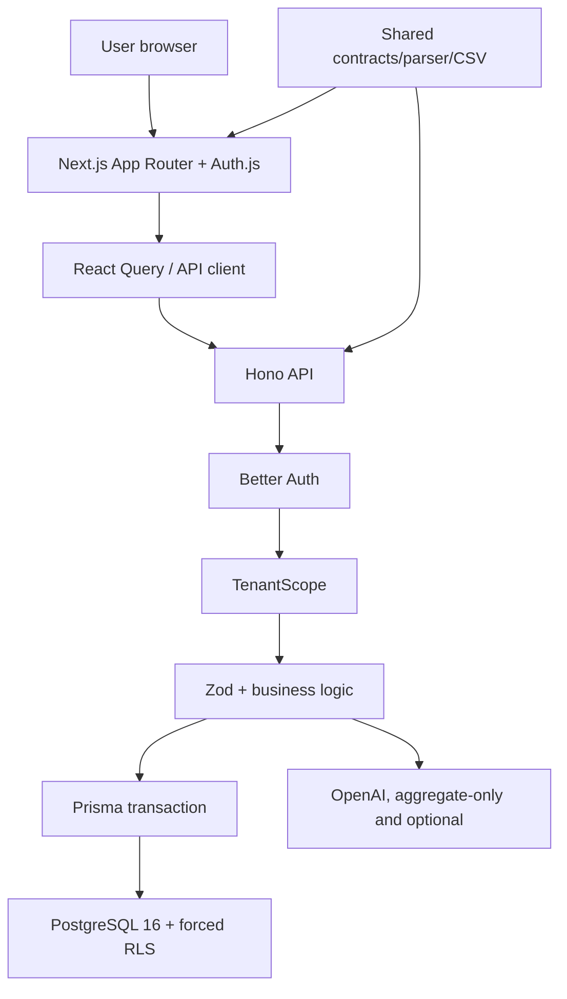
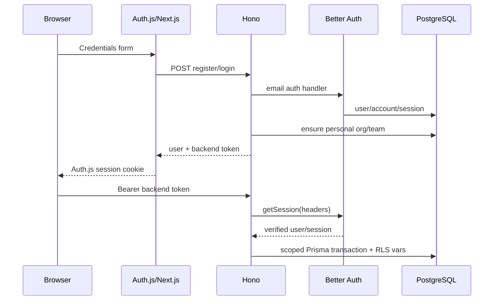
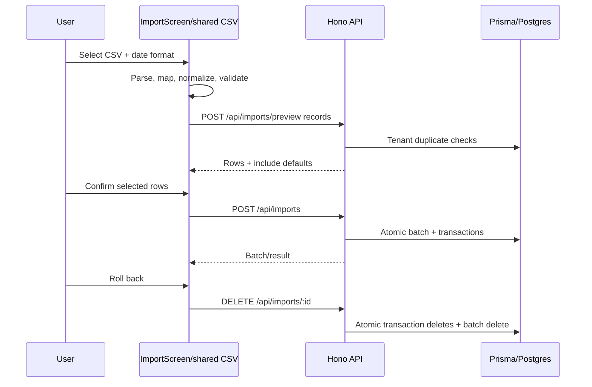

# 1. Project interview summary

## What Ledgerly is

Ledgerly is a multi-tenant personal-finance ledger. A user registers, receives a private workspace, manually creates or imports transactions, reviews and filters them, sees per-currency analytics and inferred recurring charges, and manages merchant-to-category rules. The backend also exposes deterministic text extraction, CSV export, and aggregate-only OpenAI insights, although those three capabilities are currently reachable only from an unreferenced legacy dashboard rather than the active routed UI (`apps/frontend/src/components/ledger-app.tsx:8-14`, `apps/frontend/src/components/dashboard.tsx:177-447`).

The product addresses a mundane but real problem: bank text and CSV exports are inconsistent, hard to query, and risky to mix across users. Ledgerly turns them into validated records while treating the browser as an untrusted client. Ownership is derived from a verified session and enforced both in Prisma filters and PostgreSQL row-level security (RLS) (`apps/backend/src/tenant.ts:8-47`, `apps/backend/src/db.ts:9-14`, `apps/backend/prisma/rls.sql:1-39`).

Core active flow: register/login → Auth.js holds a backend bearer token → protected Next.js page → React Query calls Hono → Better Auth verifies identity → tenant scope is resolved → Zod validates input → Prisma transaction sets RLS context → PostgreSQL reads/writes → presenter serializes decimals/dates → React Query refreshes the UI (`apps/frontend/src/auth.ts:20-98`, `apps/frontend/src/app/transactions/page.tsx:5-8`, `apps/frontend/src/features/ledger/queries.ts:42-74`, `apps/backend/src/index.ts:125-140`, `apps/backend/src/transaction-presenter.ts:3-21`).

Business value comes from clean, isolated, queryable records; duplicate/review signals; safe rollback of CSV batches; and analytics that never add unlike currencies (`apps/backend/src/index.ts:288-399`, `apps/backend/src/analytics.ts:18-69`).

## Stack and hardest parts

| Area | Technology | Evidence |
|---|---|---|
| Monorepo | npm workspaces, strict TypeScript | `package.json:5-20`, `tsconfig.base.json:2-14` |
| Frontend | Next.js 15 App Router, React 19, Tailwind 4, React Query, Recharts | `apps/frontend/package.json:12-29` |
| API | Hono on Node | `apps/backend/src/index.ts:1-17`, `apps/backend/src/index.ts:598-602` |
| Auth | Better Auth source of truth; Auth.js credentials/JWT bridge | `apps/backend/src/auth.ts:7-35`, `apps/frontend/src/auth.ts:4-100` |
| Data | PostgreSQL 16, Prisma 6, migrations, forced RLS | `docker-compose.yml:1-17`, `apps/backend/prisma/schema.prisma:1-8`, `apps/backend/prisma/rls.sql:1-39` |
| Validation/parsing | Zod plus deterministic parser/CSV normalizer | `packages/shared/src/contracts.ts:1-83`, `packages/shared/src/transaction-extractor.ts:69-139`, `packages/shared/src/csv.ts:18-112` |
| Optional AI | OpenAI Responses API with JSON Schema | `apps/backend/src/openai-insights.ts:23-95` |
| Tests/CI | Jest, database integration, Playwright, GitHub Actions | `jest.config.cjs:1-15`, `playwright.config.ts:3-32`, `.github/workflows/ci.yml:8-55` |

The strongest interview topics are layered tenant isolation, concurrent-update protection with `expectedUpdatedAt`, cursor pagination, atomic import rollback, per-currency analytics, deterministic parsing, and the privacy boundary that sends aggregates—not raw finance text—to OpenAI (`apps/backend/src/index.ts:241-285`, `apps/backend/src/index.ts:401-443`, `apps/backend/src/openai-insights.ts:43-62`).

## Pitches

**30 seconds.** “Ledgerly is a TypeScript personal-finance ledger that converts manual, CSV, or bank-text input into tenant-isolated transactions. It uses Next.js and React Query on the frontend, Hono and Better Auth on the backend, and Prisma/PostgreSQL with forced RLS. The interesting parts are server-derived ownership, cursor pagination, duplicate detection, import rollback, per-currency analytics, and optional OpenAI insights that receive aggregates only.”

**60 seconds.** Add: “Auth.js is only the Next.js session bridge; Better Auth remains the identity source. Every protected request resolves `{userId, organizationId, teamId}` from the verified session. A Prisma transaction sets PostgreSQL session variables before touching RLS-protected tables. Shared Zod contracts protect write boundaries. The app supports manual CRUD, CSV preview/import/rollback, category rules, recurring-charge heuristics, and analytics. I would be honest that parts of the richer legacy dashboard are no longer wired into the active navigation and that scalability and observability still need work.”

**2 minutes.** Start with the user problem, trace one transaction from form to database and back, explain defense-in-depth isolation, then discuss trade-offs: deterministic parsing is cheap/testable but narrow; in-memory aggregation and rate limiting are simple but single-instance; the Auth.js/Better Auth bridge works but adds conceptual and token-handling complexity. Finish with tests proving parser behavior, tenant isolation, imports, and mobile navigation.

# 2. Prerequisites I must know before explaining this project

## Client/server, HTTP, REST, and JSON

A browser is a client: it renders UI and sends HTTP requests. The server is authoritative because browser state can be modified by a user. HTTP combines method, URL, headers, body, status, headers, and response body. Ledgerly uses resource-oriented endpoints (`GET`, `POST`, `PATCH`, `DELETE`) and JSON contracts, plus CSV for export (`apps/backend/src/index.ts:142-583`). `apiFetch` adds JSON and bearer headers, checks the status, parses structured errors, and returns JSON (`apps/frontend/src/lib/api.ts:23-40`). Interview phrasing: “The client proposes an operation; the API authenticates, validates, authorizes, persists, and returns a stable representation.”

## Validation and contracts

TypeScript types disappear at runtime. Zod validates untrusted runtime values and can normalize them. Shared schemas enforce real dates, three-letter currency codes, signed debit/credit consistency, field lengths, batch limits, and optimistic-lock timestamps (`packages/shared/src/contracts.ts:1-83`). Route-local schemas constrain text length, filters, credentials, and pagination (`apps/backend/src/index.ts:604-676`, `apps/backend/src/index.ts:788-814`). Say: “Static types help developers; Zod protects the process boundary.”

## Authentication, authorization, sessions, bearer tokens

Authentication answers “who are you?” Authorization answers “may this identity do this?” Better Auth verifies credentials, hashes passwords through the library, persists seven-day sessions, and supports bearer/JWT and organizations (`apps/backend/src/auth.ts:7-35`). Auth.js creates its own encrypted/signed JWT-style frontend session containing the backend token (`apps/frontend/src/auth.ts:4-8`, `apps/frontend/src/auth.ts:79-98`). Protected API calls send `Authorization: Bearer …` (`apps/frontend/src/lib/api.ts:23-31`). Authorization then scopes every ledger query to the verified user and organization (`apps/backend/src/tenant.ts:8-47`, `apps/backend/src/transaction-query.ts:16-40`). Never claim passwords are hashed by custom project code; that is delegated to Better Auth.

## Relational schema, ORM, migrations, SQL, transactions, indexes

A relational database stores rows in tables with keys and constraints. A primary key identifies a row; foreign keys enforce relationships; unique constraints enforce business invariants; indexes trade write/storage cost for faster lookup. Prisma maps TypeScript operations to SQL (`apps/backend/prisma/schema.prisma:1-256`). Migrations are ordered, durable schema changes (`apps/backend/prisma/migrations/202606120001_init/migration.sql:1-230`, later migrations listed in section 6). A database transaction makes grouped work atomic; `withTenant` also scopes PostgreSQL configuration to that transaction (`apps/backend/src/db.ts:9-14`).

## Multi-tenancy and RLS

Multi-tenancy means one application/database serves isolated workspaces. Ledgerly stores both `userId` and `organizationId` on ledger data. API filters enforce them, while forced RLS rejects rows when `app.current_user_id` and `app.current_organization_id` do not match (`apps/backend/src/transaction-query.ts:16-20`, `apps/backend/prisma/rls.sql:6-39`). Say: “I use defense in depth: application scoping prevents mistakes; RLS limits the blast radius if a query forgets a filter.” Team IDs exist but ledger isolation is actually user + organization, not team (`apps/backend/src/isolation.ts:1-12`).

## Optimistic concurrency and idempotency

Optimistic concurrency detects stale writes without locking a row for the whole editing session. The UI sends `expectedUpdatedAt`; the backend compares it and performs an `updateMany` with the same timestamp, returning 409 if another write won (`apps/frontend/src/features/ledger/transactions-screen.tsx:24-30`, `apps/backend/src/index.ts:241-285`). This protects updates, but creates/imports have no idempotency key: retries can duplicate data. Duplicate detection is advisory, not idempotency (`apps/backend/src/index.ts:688-716`).

## Pagination, caching, state, forms, server/client components

Cursor pagination uses the last row’s stable sort key instead of numeric offsets. Ledgerly sorts by `(createdAt DESC, id DESC)`, fetches `limit + 1`, and encodes both values (`apps/backend/src/index.ts:401-443`, `apps/backend/src/index.ts:731-745`). React Query caches remote server state under user-specific keys and invalidates it after mutations (`apps/frontend/src/features/ledger/queries.ts:8-79`). Next.js page files are server components that read Auth.js and redirect; screens/forms marked `"use client"` hold interactive state (`apps/frontend/src/app/overview/page.tsx:1-8`, `apps/frontend/src/features/ledger/transactions-screen.tsx:1-21`). HTML form validation improves UX, but backend Zod remains authoritative (`apps/frontend/src/components/auth-form.tsx:90-131`).

## Errors, logging, rate limiting, testing, deployment, environment

Hono centralizes HTTP/Zod/unknown errors (`apps/backend/src/index.ts:585-596`). Request middleware logs request ID, route, status, and duration, but there is no structured logger, trace backend, or redaction framework (`apps/backend/src/index.ts:50-63`). Rate limiting bounds abuse, but the default map is process-local (`apps/backend/src/rate-limit.ts:7-61`). Environment variables separate secrets/config from code and are checked at startup (`apps/backend/src/env.ts:1-56`). Unit tests isolate pure logic; integration tests exercise API + database; E2E tests drive a browser (`packages/shared/src/__tests__/transaction-extractor.test.ts:3-116`, `apps/backend/src/__tests__/auth-routes.test.ts:40-153`, `e2e/auth-isolation.spec.ts:6-58`).

## Deterministic extraction, LLMs, structured output

The transaction extractor is regex/rule based, not an LLM: normalize text → find date/amount/currency/type/balance/description/category → compute confidence → validate (`packages/shared/src/transaction-extractor.ts:69-100`). This is predictable and testable but format-limited. The optional LLM feature sends aggregate summaries and subscription candidates to OpenAI, requests JSON Schema output, then parses it again with Zod (`apps/backend/src/openai-insights.ts:38-95`). There is no RAG, embedding, vector store, tool calling, streaming, eval suite, retry, or provider fallback. Interview line: “AI is used only for narrative insights, not core financial extraction or authorization.”

# 3. High-level architecture

The frontend page layer protects routes and passes token/user information into one shell (`apps/frontend/src/app/overview/page.tsx:5-8`, `apps/frontend/src/components/ledger-app.tsx:8-14`). React Query owns server-state fetching/caching (`apps/frontend/src/features/ledger/queries.ts:8-79`). Hono owns transport, CORS, logging, routes, validation, and errors (`apps/backend/src/index.ts:33-73`, `apps/backend/src/index.ts:585-602`). Better Auth owns identity (`apps/backend/src/auth.ts:7-35`); tenant resolution owns authorization context (`apps/backend/src/tenant.ts:8-47`). Prisma and RLS own persistence and final isolation (`apps/backend/src/db.ts:5-14`, `apps/backend/prisma/rls.sql:1-39`). There are no queues, workers, cron jobs, webhooks, caches outside React Query, or file-object storage. CSV files are parsed in the browser and normalized records are posted as JSON (`apps/frontend/src/features/ledger/import-screen.tsx:15-58`).

# 4. Repository map

| Path | Responsibility and interview importance |
|---|---|
| `package.json:1-31` | Workspace orchestration, quality commands, Prisma and seed scripts. Note `npm run dev` starts backend only. |
| `apps/backend/src/index.ts:1-904` | API composition root: middleware, every endpoint, schemas, duplicate/cursor/CSV/auth helpers, startup. It is too large and should be split. |
| `apps/backend/src/auth.ts:1-38` | Better Auth configuration. |
| `apps/backend/src/tenant.ts:8-120` | Session-to-tenant resolution and race-aware personal workspace provisioning. |
| `apps/backend/src/db.ts:1-15` | Prisma singleton and tenant/RLS transaction wrapper. |
| `apps/backend/src/analytics.ts:9-78` | In-memory per-currency aggregation. |
| `apps/backend/src/subscriptions.ts:17-101` | Heuristic recurring-debit detection. |
| `apps/backend/src/openai-insights.ts:14-139` | Aggregate-only structured OpenAI call and currency normalization. |
| `apps/backend/src/rate-limit.ts:3-61` | In-memory default plus unused Redis-capable implementation. |
| `apps/backend/src/transaction-query.ts:4-41` | Central tenant-safe filters. |
| `apps/backend/src/transaction-presenter.ts:3-21` | Converts Prisma Decimal/Date values to JSON-safe numbers/strings. |
| `apps/backend/prisma/schema.prisma:1-256` | Complete database model and indexes. |
| `apps/backend/prisma/migrations/*` | Historical SQL, including RLS and imports. |
| `packages/shared/src/contracts.ts:1-132` | Shared runtime contracts and response types. |
| `packages/shared/src/transaction-extractor.ts:30-315` | Deterministic extraction pipeline. |
| `packages/shared/src/csv.ts:4-112` | CSV parser, header mapping, date/row normalization. |
| `apps/frontend/src/auth.ts:4-176` | Auth.js credentials bridge and backend-token storage. |
| `apps/frontend/src/lib/api.ts:1-56` | Browser API base URL, bearer requests, error decoding. |
| `apps/frontend/src/app/**/page.tsx` | Public auth and protected routed pages. |
| `apps/frontend/src/components/ledger-app.tsx:1-15` | Active screen switch. This proves which UI is live. |
| `apps/frontend/src/features/ledger/queries.ts:8-79` | User-keyed React Query hooks/mutations. |
| `overview-screen.tsx:16-51` | Analytics, chart, recurring charges, empty/error/loading states. |
| `transactions-screen.tsx:13-64` | Filters, infinite list, manual create/edit/delete, responsive UI. |
| `import-screen.tsx:15-87` | Client CSV parse/map, server preview, selection, import, rollback. |
| `rules-screen.tsx:11-29` | Category-rule list/create/delete. No edit UI despite PATCH API. |
| `apps/frontend/src/components/dashboard.tsx:177-1221` | Legacy/unreferenced monolith containing preview, export, insights and older UI. It is not imported by active code. |
| `apps/**/__tests__`, `packages/**/__tests__`, `e2e/` | Pure, integration, and browser verification. |
| `.github/workflows/ci.yml:8-55` | PostgreSQL-backed CI pipeline. |
| `docker-compose.yml:1-20` | Local database only; app services are not containerized. |

Generated/local artifacts such as `.DS_Store`, `tsconfig.tsbuildinfo`, `test-results`, and `graphify-out` are not production source. Several are untracked in the current worktree. No production code was changed for these notes.

# 5. Runtime and startup flow

1. `docker compose up -d` starts PostgreSQL 16 on host port 5433 and initializes the non-owner runtime role (`docker-compose.yml:1-17`, `apps/backend/prisma/init-runtime-role.sql:1-13`).
2. Generate Prisma client and migrate with the owner URL (`package.json:17-19`, `.env.example:1-4`).
3. Backend dev runs `tsx watch src/index.ts`; import of `env.ts` loads dotenv and fails fast for missing database/auth secrets or unsafe production localhost origins (`apps/backend/package.json:6-10`, `apps/backend/src/env.ts:1-56`). Importing `db.ts` constructs Prisma; importing `auth.ts` configures Better Auth. `index.ts` registers CORS, logging, health, auth and protected routes before `serve` listens on port 4000 (`apps/backend/src/index.ts:33-140`, `apps/backend/src/index.ts:598-602`).
4. Frontend dev runs Next.js on 3000 (`apps/frontend/package.json:6-10`). Root layout initializes fonts, React Query and toasts (`apps/frontend/src/app/layout.tsx:8-24`, `apps/frontend/src/components/providers.tsx:7-18`). `/` redirects to `/overview`; protected page server components call `auth()` and redirect when token/user are absent (`apps/frontend/src/app/page.tsx:1-4`, `apps/frontend/src/app/overview/page.tsx:5-8`).
5. Root `npm run dev` misleadingly starts only the backend, so use separate `dev:backend` and `dev:frontend` terminals (`package.json:9-13`). There is no Dockerfile or deployment manifest; deployment platform is not confirmed from codebase.

# 6. Database deep dive

## Entities and relationships

Auth-owned models are `User`, `Session`, `Account`, `Verification`, `Jwks`, `Organization`, `Member`, `Invitation`, `Team`, and `TeamMember` (`apps/backend/prisma/schema.prisma:10-150`). Ledger models are `Transaction`, `ImportBatch`, and `CategoryRule` (`apps/backend/prisma/schema.prisma:152-240`). A user joins organizations through `Member`; an organization has teams; sessions remember active organization/team. Transactions belong to a user and organization, optionally a team/import batch/duplicate transaction. Import batches group imported transactions. Category rules map one normalized phrase to one category per organization.

`Transaction` uses a CUID primary key, `Decimal(12,2)` money, UTC `DateTime`, enum type/status/source, confidence, raw text, timestamps, ownership FKs, and self-referential duplicate relation (`apps/backend/prisma/schema.prisma:152-203`). Decimal avoids binary floating-point storage error, though the app converts values to JavaScript numbers for responses/analytics (`apps/backend/src/transaction-presenter.ts:3-21`). That conversion is acceptable at current scale but not ideal for arbitrary financial precision.

Important constraints/indexes: unique user email, session token, organization slug, organization membership, team membership, category rule `(organizationId, matchText)`, plus tenant/date/status/category/account/import/duplicate indexes (`apps/backend/prisma/schema.prisma:10-150`, `apps/backend/prisma/schema.prisma:181-203`, `apps/backend/prisma/schema.prisma:220-239`). The list query order `(createdAt,id)` matches composite indexes (`apps/backend/src/index.ts:425-432`). Search uses case-insensitive substring and cannot efficiently use a normal B-tree; production search would need PostgreSQL trigram/full-text indexing (`apps/backend/src/transaction-query.ts:22-24`).

## Migration history

- Initial auth/organization/transaction schema: `apps/backend/prisma/migrations/202606120001_init/migration.sql:1-230`.
- JWK storage for JWT plugin: `202606130001_add_jwks/migration.sql:1-12`.
- Review/account/duplicate/rules/indexes and initial RLS: `202606130002_transaction_management_expansion/migration.sql:1-46`.
- Currency: `202606190001_add_transaction_currency/migration.sql:1`.
- Imports/source/self-FK and stricter user+org RLS: `202606240001_imports_and_transaction_source/migration.sql:1-40`.

`seed.ts` creates only two explicit demo users and tenant-scoped demo rows (`apps/backend/src/seed.ts:40-107`, `apps/backend/src/demo-users.ts:1-4`). Interview caution: seed contents are demo data, not automatic data for every signup.

## Risks and questions

- `ImportBatch` RLS is added, but the standalone `rls.sql` must stay synchronized with migrations (`apps/backend/prisma/rls.sql:28-39`).
- Auth/organization tables are not RLS protected; access relies on Better Auth and carefully scoped app queries.
- `teamId` is not part of ledger RLS, so this is personal user isolation inside an organization, not true team-shared accounting.
- Analytics reads at most 5,000 rows and subscriptions 2,000, silently truncating results (`apps/backend/src/analytics.ts:9-15`, `apps/backend/src/subscriptions.ts:17-24`).

Interview Q: “Why both userId and organizationId?” Answer: “Organization models tenancy, while userId ensures personal isolation even inside an organization; current RLS requires both. That is stricter than organization-sharing and should be an explicit product choice.”

# 7. API deep dive

All ledger endpoints below run through `scopedAuth`, which calls Better Auth and derives tenant context (`apps/backend/src/index.ts:125-140`, `apps/backend/src/tenant.ts:8-47`). Errors share `{error:{code,message,issues?}}` (`apps/backend/src/index.ts:585-596`).

## Endpoint: `GET /health` and `GET /ready`

Purpose: liveness versus database readiness. No auth. `/health` returns `{ok:true}`; `/ready` executes `SELECT 1` and returns 503 on failure (`apps/backend/src/index.ts:65-73`). Security improvement: rate limit/limit diagnostic detail at the edge.

## Endpoint: `POST /api/auth/register`

Request `{name?,email,password}` validated at `apps/backend/src/index.ts:788-809`. The handler forwards to Better Auth email signup, extracts token/user, provisions a personal org/team transactionally, and copies auth headers (`apps/backend/src/index.ts:75-98`, `apps/backend/src/index.ts:816-895`, `apps/backend/src/tenant.ts:50-103`). Caller: Auth.js credentials provider in register mode (`apps/frontend/src/auth.ts:20-38`). Response `{user,token,jwt?}`. Errors include validation, duplicate/Better Auth error, malformed upstream session, or provisioning/database failure.

## Endpoint: `POST /api/auth/login`

Request `{email,password}` (`apps/backend/src/index.ts:811-814`). It forwards to Better Auth sign-in, verifies complete payload, ensures an existing/personal tenant, and returns auth material (`apps/backend/src/index.ts:100-121`). Caller and response mirror registration (`apps/frontend/src/auth.ts:20-75`). Risk: two session systems and backend bearer token stored inside the Auth.js token increase secret exposure impact.

## Endpoint: `POST /api/transactions/preview`

Request `{text:8..50000,accountLabel?}`; rate limited; loads tenant rules; splits and deterministically parses text; checks each draft for duplicates; does not persist (`apps/backend/src/index.ts:142-164`, `apps/backend/src/index.ts:609-612`, `packages/shared/src/transaction-extractor.ts:69-139`). Response `{drafts}`. Active frontend caller: none. Legacy caller: `apps/frontend/src/components/dashboard.tsx:262-279`.

## Endpoint: `POST /api/transactions`

Request `{drafts:[1..100]}` using shared transaction schema (`apps/backend/src/index.ts:166-204`, `apps/backend/src/index.ts:614-618`, `packages/shared/src/contracts.ts:18-42`). It rate limits, validates any `duplicateOfId` belongs to this tenant, overwrites ownership from scope, writes sequentially in one DB transaction, and returns 201 presented rows. Active manual caller wraps one draft with confidence 1/source MANUAL (`apps/frontend/src/features/ledger/queries.ts:46-49`). A failure rolls back all drafts. Weakness: sequential inserts and no idempotency key.

## Endpoint: `POST /api/transactions/extract`

Request `{text:8..10000,accountLabel?}`. It combines parser, category rules, duplicate check and a single insert (`apps/backend/src/index.ts:206-239`, `apps/backend/src/index.ts:604-607`). Response `{transaction,duplicate}`, 201. No active caller; core parser is deterministic, not AI.

## Endpoint: `GET /api/transactions`

Query supports cursor, limit ≤50, search/date/type/category/status/account/currency/minConfidence (`apps/backend/src/index.ts:625-676`). It validates the cursor row belongs to the tenant, applies tenant-safe filters, fetches `limit+1`, and responds `{items,transactions,nextCursor}` (`apps/backend/src/index.ts:401-443`). Caller: infinite query with page size 20 (`apps/frontend/src/features/ledger/queries.ts:24-31`). Weakness: limit schema does not explicitly reject nonnumeric, zero, or negative strings before `Number()`.

## Endpoint: `PATCH /api/transactions/:id`

Body is partial transaction fields plus required `expectedUpdatedAt` (`packages/shared/src/contracts.ts:44-52`). It checks ownership, compares timestamps, revalidates the merged record, conditionally updates with the same timestamp, and returns 404/409 appropriately (`apps/backend/src/index.ts:241-285`). Caller: active edit screen (`apps/frontend/src/features/ledger/transactions-screen.tsx:24-30`). This is a strong live-walkthrough endpoint.

## Endpoint: `DELETE /api/transactions/:id`

It first finds by id + tenant, deletes, and returns `{ok:true}` or tenant-safe 404 (`apps/backend/src/index.ts:494-512`). Caller: `apps/frontend/src/features/ledger/queries.ts:54-57`. A 404 avoids revealing another tenant’s row.

## Endpoint: `GET /api/transactions/export`

Applies the same filters, caps at 1,000, escapes CSV quotes/newlines, and sets attachment headers (`apps/backend/src/index.ts:383-399`, `apps/backend/src/index.ts:762-775`). No active caller; legacy caller at `apps/frontend/src/components/dashboard.tsx:404-418`. Weakness: silent 1,000-row truncation and in-memory generation.

## Endpoint: `POST /api/imports/preview`

Body has filename plus 1..1000 validated CSV records (`packages/shared/src/contracts.ts:66-72`). It checks database duplicates and within-file fingerprints, returning include defaults and warnings (`apps/backend/src/index.ts:288-312`). Caller: active import screen after browser-side parse/normalization (`apps/frontend/src/features/ledger/import-screen.tsx:39-54`). Complexity is O(rows × duplicate query), an N+1 risk.

## Endpoint: `POST /api/imports`

Body adds `include` per record (`packages/shared/src/contracts.ts:74-83`). It creates an import batch and sequential transactions atomically, validating duplicate references (`apps/backend/src/index.ts:314-358`). Caller: `apps/frontend/src/features/ledger/queries.ts:58-61`. No idempotency; retry can create another batch.

## Endpoint: `GET /api/imports` and `DELETE /api/imports/:id`

List returns the latest 50 owned batches (`apps/backend/src/index.ts:360-368`). Delete verifies ownership, deletes associated owned transactions, then batch in one transaction and returns count (`apps/backend/src/index.ts:370-381`). Callers: `apps/frontend/src/features/ledger/queries.ts:34-36`, `apps/frontend/src/features/ledger/queries.ts:62-65`. “Rollback” is destructive deletion, not event-sourced reversal.

## Endpoint: `GET /api/analytics/summary`

Same filters; loads up to 5,000 rows; groups totals/month/category by currency and counts duplicate/review rows (`apps/backend/src/index.ts:445-451`, `apps/backend/src/analytics.ts:9-69`). Caller: active overview (`apps/frontend/src/features/ledger/overview-screen.tsx:16-25`). Response contract: `packages/shared/src/contracts.ts:109-121`.

## Endpoint: `GET /api/analytics/subscriptions`

Loads up to 2,000 debits, groups normalized merchant + currency + 25-unit amount band, requires three rows and cadence agreement, then scores variance/cadence (`apps/backend/src/index.ts:453-459`, `apps/backend/src/subscriptions.ts:17-101`). Caller: overview (`apps/frontend/src/features/ledger/overview-screen.tsx:18-21`). Results are inferred, not persisted.

## Endpoint: `POST /api/insights/generate`

Optional filters are validated (`apps/backend/src/index.ts:634-646`). The route rate limits, computes tenant aggregates/subscriptions, short-circuits empty/<3, and calls OpenAI; config problems become explicit statuses (`apps/backend/src/index.ts:461-492`). No active caller; legacy caller at `apps/frontend/src/components/dashboard.tsx:208-218`. Provider failures become generic 500; no retry/timeout/fallback.

## Category rule endpoints

`GET` lists owned rules; `POST` validates and upserts by organization + exact trimmed match; `PATCH/:id` ownership-checks and updates; `DELETE/:id` ownership-checks and removes (`apps/backend/src/index.ts:514-583`, schema `apps/backend/src/index.ts:620-623`). Active UI calls GET/POST/DELETE but not PATCH (`apps/frontend/src/features/ledger/queries.ts:38-39`, `apps/frontend/src/features/ledger/queries.ts:66-73`). Rules are applied before explicit and built-in categories (`packages/shared/src/transaction-extractor.ts:254-293`).

# 8. Frontend deep dive

Public `/login` and `/register` render accessible credential forms and contextual security copy (`apps/frontend/src/app/login/page.tsx:5-48`, `apps/frontend/src/app/register/page.tsx:5-48`). `AuthForm` owns pending/error state, calls Auth.js, shows toast/inline errors, refreshes and routes to overview (`apps/frontend/src/components/auth-form.tsx:17-71`, `apps/frontend/src/components/auth-form.tsx:90-135`).

Protected `/overview`, `/transactions`, `/import`, `/rules` repeat a server-side Auth.js check, then render `LedgerApp`/`LedgerShell` (`apps/frontend/src/app/overview/page.tsx:5-8`, analogous page files). `LedgerShell` provides responsive nav, user display, logout, and user-scoped cache clearing (`apps/frontend/src/components/ledger-shell.tsx:12-64`).

Overview fetches analytics and subscriptions, has loading/error/empty states, separates currencies, renders review metrics, a Recharts cash-flow chart, and recurring charges (`apps/frontend/src/features/ledger/overview-screen.tsx:16-51`). It does not currently show AI insights.

Transactions owns draft/applied filters, infinite pages, modal create/edit/delete state, desktop table/mobile cards, confirmation, loading/error/empty states, and optimistic concurrency input (`apps/frontend/src/features/ledger/transactions-screen.tsx:13-64`). The visible filter UI exposes only search, from-date, type, status, and currency even though API/types support more; there is no export button.

Import reads file text in the browser, parses/maps headers, lets the user choose date format, calls server preview, defaults duplicates to skipped, imports selected records, lists completed batches, and can roll them back (`apps/frontend/src/features/ledger/import-screen.tsx:15-87`, `packages/shared/src/csv.ts:18-112`). This is not a multipart upload; the raw file is not stored.

Rules lists/create/deletes mappings (`apps/frontend/src/features/ledger/rules-screen.tsx:11-29`). PATCH exists in backend but no edit UI.

React Query keys include `userId` to prevent cross-account cache mixing, mutations invalidate the user root, and logout removes it (`apps/frontend/src/features/ledger/queries.ts:8-79`). There are no component/unit tests for the active React screens. The 1,221-line `Dashboard` is dead/legacy based on zero imports and should be removed or decomposed after porting desired features.

# 9. Auth and security deep dive

Registration/login validation and friendly errors live in `apps/backend/src/index.ts:75-121`, `apps/backend/src/index.ts:777-895`. Better Auth config controls password minimum, seven-day session, daily refresh, bearer/JWT and org/team plugins (`apps/backend/src/auth.ts:7-35`). Auth.js uses credentials and a seven-day JWT session, storing the Better Auth token in callbacks (`apps/frontend/src/auth.ts:4-100`). The catch-all NextAuth route is `apps/frontend/src/app/api/auth/[...nextauth]/route.ts:1-3`.

Server pages are UX guards; the real security boundary is backend `getTenantScope` plus query/RLS scoping (`apps/backend/src/tenant.ts:8-47`). Active org is membership-validated; active team is also membership-validated (`apps/backend/src/tenant.ts:16-29`, `apps/backend/src/tenant.ts:105-111`). Signup provisioning uses SERIALIZABLE and tolerates unique/serialization conflicts (`apps/backend/src/tenant.ts:71-102`).

Security strengths: parameterized Prisma/raw templates limit SQL injection (`apps/backend/src/db.ts:9-14`); Zod limits input; exact trusted CORS origins with credentials are configured (`apps/backend/src/index.ts:35-48`); production rejects localhost origins (`apps/backend/src/env.ts:30-56`); unknown ownership fields are stripped by Zod objects and writes use server scope; RLS is forced; passwords/secrets are not logged intentionally.

Weaknesses: no CSRF token is visible. Bearer authorization reduces CSRF relevance for API calls, but cookies are also accepted and Better Auth/Auth.js cookie settings are library defaults—exact SameSite/Secure behavior is not confirmed from codebase. No CSP/security-header middleware is visible. No email verification requirement is enforced. Rate limiting covers selected write/AI routes but not login/register/list routes, and defaults to per-process memory (`apps/backend/src/rate-limit.ts:51-61`). Redis implementation is never configured. Tokens are exposed to client components as props and readable by JavaScript, increasing XSS impact (`apps/frontend/src/app/overview/page.tsx:8`). Raw transaction text is retained in DB, which is sensitive (`apps/backend/prisma/schema.prisma:174-181`). Secret rotation, audit logs, encryption at rest, backups, retention, and account deletion are not confirmed from codebase.

# 10. Core feature flows end-to-end

## Signup/login

User submits `AuthForm` → Auth.js credentials provider calls Hono → Zod validates → Better Auth creates/verifies account/session → `ensurePersonalTenant` creates org/member/team/teamMember with SERIALIZABLE isolation → backend token enters Auth.js JWT/session → page redirects to overview (`apps/frontend/src/components/auth-form.tsx:22-71`, `apps/frontend/src/auth.ts:20-98`, `apps/backend/src/index.ts:75-121`, `apps/backend/src/tenant.ts:50-103`). Errors: deployment URL missing, backend unreachable, duplicate/invalid credentials, DB failure.

## Manual transaction create/edit/delete

Transactions screen opens `TransactionForm` → create mutation posts one draft → shared schema validates sign/date/currency → backend injects ownership and writes inside RLS transaction → presenter returns JSON → React Query invalidates all user ledger queries → list/analytics refresh (`apps/frontend/src/features/ledger/transactions-screen.tsx:13-37`, `apps/frontend/src/features/ledger/queries.ts:42-57`, `apps/backend/src/index.ts:166-204`). Edit adds timestamp conflict detection; delete returns tenant-safe 404 (`apps/backend/src/index.ts:241-285`, `apps/backend/src/index.ts:494-512`).

## CSV import and rollback

Evidence: `apps/frontend/src/features/ledger/import-screen.tsx:15-87`, `packages/shared/src/csv.ts:18-112`, `apps/backend/src/index.ts:288-381`. Errors include invalid/ambiguous dates, missing mapping, over 1,000 records, duplicate warnings, network/DB failure. “Rollback” permanently deletes imported rows.

## Analytics and subscriptions

Overview calls two protected GETs → shared filter builder injects tenant ownership → rows are aggregated by currency or passed to recurring heuristic → UI renders cards/chart/list (`apps/frontend/src/features/ledger/overview-screen.tsx:16-45`, `apps/backend/src/analytics.ts:9-69`, `apps/backend/src/subscriptions.ts:17-101`). Empty/loading/error states exist for analytics; subscription errors are not explicitly rendered.

## Text extraction and AI insights

Backend flows are implemented (`apps/backend/src/index.ts:142-239`, `apps/backend/src/index.ts:461-492`), but active screens do not call them. Legacy `Dashboard` does (`apps/frontend/src/components/dashboard.tsx:208-279`). Interview answer must distinguish “API implemented and tested partly” from “currently available in routed UI.”

# 11. Important functions/classes/modules explained

| Symbol | Explanation, inputs/outputs, side effects, risks, oral phrasing |
|---|---|
| `getTenantScope`, `apps/backend/src/tenant.ts:8-47` | Headers → verified `{userId,organizationId,teamId}`; queries memberships and may update sessions/provision tenant. Removing it breaks authorization. Say: “It converts identity into server-trusted ownership.” |
| `ensurePersonalTenant`, `tenant.ts:50-103` | User → scope; creates org graph transactionally with concurrency handling. Race edge cases handled via SERIALIZABLE/P2002/P2034. |
| `withTenant`, `db.ts:9-14` | Scope + callback → callback result; opens DB transaction and sets transaction-local RLS variables. All RLS-protected access must use it. |
| `buildTransactionWhere`, `transaction-query.ts:16-40` | Scope + optional filters → Prisma where. Central invariant: filters only add restrictions, never replace ownership. |
| `extractTransaction`, `packages/shared/src/transaction-extractor.ts:69-100` | Raw text/options → validated structured record. Pure except current-date fallback. Regex limits and silent fallback are important. |
| `createTransactionDrafts`, `transaction-extractor.ts:102-113` | Bulk text → editable drafts with confidence status/account. |
| `parseCsv`, `packages/shared/src/csv.ts:18-47` | CSV string → headers/rows; handles quotes and escaped quotes. It is a small custom parser, so exotic CSV dialects are risky. |
| `normalizeCsvRows`, `csv.ts:63-94` | Rows/mapping/date format → record-or-errors array; normalizes amount sign/currency. |
| `summarizeTransactions`, `apps/backend/src/analytics.ts:18-69` | Transaction rows → per-currency totals/series/categories/counts. Pure/testable but memory-bound. |
| `detectSubscriptionCandidates`, `subscriptions.ts:27-66` | Rows → top 12 heuristic candidates. Amount bands/cadence tolerances may create false positives/negatives. |
| `generateSpendingInsights`, `openai-insights.ts:23-96` | Aggregates/subscriptions/context → max four validated cards; external network/cost side effect. Invalid JSON/Zod/provider errors propagate. |
| `MemoryRateLimiter.consume`, `rate-limit.ts:11-32` | Key/limit/window → allowed boolean; mutates local buckets. Resets on restart and is inconsistent across replicas. |
| `apiFetch`, `apps/frontend/src/lib/api.ts:23-40` | Path/token/init → typed JSON or thrown Error; network side effect. Generic typing does not runtime-validate responses. |
| `useLedgerMutations`, `features/ledger/queries.ts:42-74` | Builds mutation hooks and invalidates user cache. Broad invalidation is correct but potentially chatty. |
| `AuthForm.onSubmit`, `components/auth-form.tsx:22-71` | Form event → Auth.js credential login/register, UI state/toasts/navigation. |

Beginner explanation: each function has one boundary job—identify, validate, scope, transform, persist, or present. Deeper explanation: correctness depends on composing invariants; Zod alone does not authorize, tenant filters alone do not survive a forgotten query, and RLS alone needs correctly set transaction-local variables.

# 12. AI/LLM-specific deep dive if present

Provider/model: OpenAI Responses API; configurable `OPENAI_MODEL`, default `gpt-4.1-mini` (`apps/backend/src/env.ts:12-14`, `apps/backend/src/openai-insights.ts:38-42`). Input is a system privacy/currency instruction plus JSON containing optional filters, per-currency aggregate summary, and recurring candidates (`apps/backend/src/openai-insights.ts:43-62`). It deliberately excludes raw transaction text and identity.

Output uses provider-side JSON Schema—object with up to four `{title,summary,severity,metric}` cards—and application-side Zod validation/length bounds (`apps/backend/src/openai-insights.ts:14-21`, `apps/backend/src/openai-insights.ts:64-95`). Currency context prevents adding mixed currencies and post-processing replaces stray dollar wording for non-USD single-currency output (`apps/backend/src/openai-insights.ts:100-139`).

There is no retry, timeout, fallback, caching, streaming, moderation, explicit token budget, cost telemetry, prompt/version tracking, red-team tests, or evals. JSON parsing can fail if output is empty/malformed despite structured-output request. Provider errors become 500. Prompt injection risk is low because only app-computed aggregates and filter strings are supplied, but user-controlled filter text still enters JSON. Financial hallucinations remain possible; insights should be labeled advisory. No RAG pipeline exists: no ingestion, chunking, embeddings, vector DB, retrieval, reranking, or citations.

Production improvements: deadline + abort signal; bounded retry for transient 429/5xx with jitter; request id/model/latency/token logging without sensitive payloads; caching by tenant-safe aggregate hash; eval fixtures; visible disclaimer; graceful provider-status response; schema-versioned prompts. Interview answer: “The LLM never decides source-of-truth amounts. Deterministic code computes aggregates; the model only phrases bounded insights.”

# 13. Error handling and edge cases

Backend Zod errors are 400 with issues; `HTTPException` maps status to stable codes; unknown errors are logged and return generic 500 (`apps/backend/src/index.ts:585-596`, `apps/backend/src/index.ts:897-904`). Auth forwarding has tailored duplicate/unreachable/malformed handling (`apps/backend/src/index.ts:831-886`). Frontend `apiFetch` extracts nested messages and screens show blocks/toasts (`apps/frontend/src/lib/api.ts:34-39`, `apps/frontend/src/features/ledger/transactions-screen.tsx:24-37`).

Handled: unauthenticated 401, cross-tenant 404, invalid cursor 400, stale update 409, rate limit 429, DB readiness 503, empty analytics, duplicate hints, CSV row errors, mixed currencies, AI disabled/missing/insufficient data.

Missing/weak: no global request timeout; no DB retry; no idempotent create/import; no error boundary visible; subscription query error is hidden; list-limit numeric validation is incomplete; parser defaults missing dates to today and missing amount to zero rather than forcing review/failure (`packages/shared/src/transaction-extractor.ts:69-100`); `toIso` normalizes impossible parser dates instead of rejecting the original date; duplicate check can race between check and insert; category-rule PATCH can hit unique constraint and become 500; raw provider errors have no graceful status; CSV/export/analytics are memory capped/truncated.

# 14. Testing deep dive

Run `npm test`, `npm run typecheck`, `npm run build`, and `npm run test:e2e` (`package.json:13-20`). Jest uses ts-jest ESM and scans shared/backend tests (`jest.config.cjs:1-15`).

- Parser tests cover three formats, low confidence, custom/built-in category precedence, USD, and bulk drafts (`packages/shared/src/__tests__/transaction-extractor.test.ts:3-116`).
- Contract/CSV tests cover impossible date/sign conflict, currency normalization, quoted cells, header mapping and ambiguous date normalization (`packages/shared/src/__tests__/contracts-csv.test.ts:3-29`).
- Pure analytics/subscription tests cover totals, currency isolation, recurrence (`apps/backend/src/__tests__/analytics-subscriptions.test.ts:5-52`).
- Tenant helper tests ensure filters cannot weaken scope (`apps/backend/src/__tests__/tenant.test.ts:4-65`).
- DB integration tests prove register/login, auth rejection, ownership-field tampering, cross-user list/delete/export/analytics/subscription/insight isolation, and foreign duplicate sanitization (`apps/backend/src/__tests__/auth-routes.test.ts:40-153`). They intentionally fail when Postgres is unavailable (`auth-routes.test.ts:25-37`).
- Playwright covers account-switch cache isolation, CSV duplicate/rollback, and mobile keyboard navigation (`e2e/auth-isolation.spec.ts:6-58`). CI provisions Postgres/runtime role, migrates, typechecks, tests, builds and runs Chromium (`.github/workflows/ci.yml:35-55`).

Missing priorities: route contract tests for every endpoint/status; RLS-direct negative tests with runtime role; concurrency test for PATCH; simultaneous tenant provisioning; import atomic rollback on middle-row failure; pagination boundary/cursor tampering; rule unique conflict; rate limiter; OpenAI mocked schema/provider failures; active React component tests; accessibility audit; load/security tests. There are no coverage thresholds.

# 15. Deployment and environment

Local: copy `.env.example`, start Postgres, install, generate client, migrate with owner role, then run backend/frontend separately (`.env.example:1-11`, `README.md:55-108`). Backend required: `DATABASE_URL`, `BETTER_AUTH_SECRET`, `BETTER_AUTH_URL`, and one frontend-origin variable; optional `PORT`, `OPENAI_API_KEY`, `OPENAI_MODEL`, `AI_INSIGHTS_ENABLED` (`apps/backend/src/env.ts:6-15`, `apps/backend/src/env.ts:38-47`). Frontend/Auth.js needs `AUTH_SECRET`, `AUTH_URL`, browser backend URL, and preferably internal backend URL (`apps/frontend/src/auth.ts:120-135`, `apps/frontend/src/lib/api.ts:1-15`). `.env.example` omits AI variables and `FRONTEND_ORIGINS`, although code supports them.

Build is workspace build: backend only typechecks, frontend runs `next build` (`package.json:13-14`, `apps/backend/package.json:9-10`, `apps/frontend/package.json:8-10`). There is no compiled backend artifact; production `start` uses `tsx`, so runtime ships source/dev-style transpilation. Docker Compose runs only Postgres. No app Dockerfile, IaC, health-check deployment config, process manager, reverse proxy, TLS, migration release step, or hosting provider is confirmed from codebase. Do not claim a specific deployment. Production readiness requires managed Postgres/backups, HTTPS origins/secrets, separate migrate/runtime roles, RLS verification, horizontally shared rate limiting, logs/metrics/traces, health probes, graceful shutdown, and a reproducible backend artifact/container.

# 16. Code quality review

## Strong parts

Shared runtime contracts; explicit tenant derivation; double-layer app/RLS isolation; non-owner runtime DB role; transactional imports; stale-write conflict detection; per-currency accounting; deterministic core parser; privacy-minimized AI input; user-keyed query cache; realistic database/E2E isolation tests; production localhost checks.

## Weak/under-engineered

`apps/backend/src/index.ts` (904 lines) mixes composition, routes, schemas and helpers. The legacy `dashboard.tsx` (1,221 lines) is dead but contains features absent from the active UI. Analytics/subscriptions are capped in-memory. Import preview performs an N+1 query. Create/import lack idempotency. Default rate limiting is single-process and incomplete. Logging is minimal; no audit trail. UI/API feature parity is inconsistent. Active frontend has no component tests. Exact cookie/CSRF/security headers are not configured visibly.

## Confusing/duplicated

Auth.js plus Better Auth is defensible as a bridge but complex. `@better-auth/prisma-adapter` appears in dependencies while code imports `better-auth/adapters/prisma` (`apps/backend/package.json:12-21`, `apps/backend/src/auth.ts:1-3`). `backendInternalUrl` and `apiText` are unused by active screens (`apps/frontend/src/lib/api.ts:3-56`). Transaction response includes both `items` and legacy `transactions` aliases (`apps/backend/src/index.ts:438-442`). Shared `transactionFilterSchema` exists, but backend defines another query schema (`packages/shared/src/contracts.ts:54-64`, `apps/backend/src/index.ts:662-676`).

## Honest interviewer response

“The security/data boundaries are the strongest part. The main weakness is integration drift: an older dashboard contains extraction/export/AI UI while the newer routed screens do not. I would first add feature-parity tests, port or deliberately remove those capabilities, delete dead code, then split the API by domain. I would not call the current system fully production-ready because rate limiting, observability, large-data aggregation, idempotency and deployment packaging are incomplete.”

# 17. Performance and scalability

At 10 users, one Node process + Postgres is adequate. Reads are indexed and list pagination is bounded. At 10,000 users, bottlenecks are: analytics fetching 5,000 full rows per request; subscriptions fetching 2,000; import preview N+1 duplicate queries; sequential inserts; substring search; broad React Query invalidation; process-local limiter; no connection-pool/serverless plan; synchronous OpenAI latency (`apps/backend/src/analytics.ts:9-15`, `apps/backend/src/subscriptions.ts:17-24`, `apps/backend/src/index.ts:288-357`).

Scale path: retain cursor pagination; move analytics to SQL `GROUP BY` or materialized summaries; calculate recurrence offline or incrementally; bulk duplicate lookup and `createMany`; add a unique/import idempotency key where business semantics allow; add pg_trgm/full-text index; use Redis limiter/cache; bound/queue AI work or stream status; add DB pooling/read replicas only after measurement; paginate imports/rules; expose export as streamed/background job for large data. Horizontal replicas require shared rate-limit/cache state. There are no background workers today.

# 18. Interview Q&A bank

1. **What is it?** A tenant-isolated finance ledger for validated manual/CSV/text-derived records, analytics, rules and recurring-charge detection.
2. **Why this stack?** TypeScript shares concepts end to end; Next.js supplies routing/server auth guards; Hono is a small typed API layer; Prisma speeds relational work; PostgreSQL provides transactions, indexes and RLS.
3. **Hardest part?** Making ownership a cross-layer invariant: verified session → tenant scope → Prisma filter → transaction-local RLS.
4. **Why two auth libraries?** Better Auth owns credentials/sessions/orgs; Auth.js bridges that backend token into Next.js pages/components. It works, but adds complexity I would reassess.
5. **Authentication vs authorization?** Better Auth proves user identity; tenant membership and scoped queries decide row access.
6. **How prevent cross-user access?** Ignore caller ownership, derive scope, filter user+org, validate referenced IDs, and force RLS.
7. **Why RLS if filters exist?** Defense in depth against forgotten/malformed application queries.
8. **Transaction create flow?** Form → bearer JSON → auth/scope → Zod → RLS transaction → Prisma insert → presenter → cache invalidation.
9. **Why cursor pagination?** Stable and efficient under inserts compared with large offsets; composite tie-breaker avoids duplicate timestamps.
10. **Two simultaneous edits?** `expectedUpdatedAt` and conditional update cause one winner and a 409 for stale writer.
11. **Two simultaneous creates?** Both may persist; no idempotency/unique business key. Duplicate checking is advisory and race-prone.
12. **Database down?** `/ready` returns 503; most API calls become generic 500. Frontend shows error, but retries/degraded mode are limited.
13. **How does parsing work?** Deterministic regex/rules plus weighted confidence and Zod validation; it is not LLM extraction.
14. **Why deterministic?** Cheap, fast, reproducible, private, testable; downside is narrow format coverage.
15. **How CSV import works?** Browser parse/map/normalize, server validation/duplicate preview, atomic batch insert, destructive rollback by batch.
16. **How analytics handles currencies?** Separate buckets; never convert or sum different currency codes.
17. **How recurrence works?** Merchant normalization + currency + amount band, at least three debits, cadence gap tolerances, variance score.
18. **What if LLM output is invalid?** JSON parse or Zod fails and currently returns generic 500; add graceful error, timeout/retry and evals.
19. **Does AI see raw finance data?** No: only aggregate summaries, recurring candidates and filters are sent.
20. **Is it production ready?** Security foundations are thoughtful, but deployment packaging, observability, distributed limiting, idempotency and scale need work.
21. **How know it works?** Pure unit tests, Postgres-backed API isolation tests, Playwright account-switch/import/mobile tests, all run in CI.
22. **What would you improve first?** Resolve active UI/legacy-dashboard drift, add integration coverage, split API modules, then address shared rate limiting and SQL aggregation.
23. **Why Decimal?** Exact two-decimal storage; JavaScript number conversion is a presentation compromise.
24. **What happens with tampered IDs?** Unknown ownership fields are not used; duplicate references are tenant-validated; other-tenant resources appear not found.
25. **Did you use AI to build this?** “Yes. I used AI as a coding assistant for scaffolding, alternatives and review. I did not treat generated code as authority: I traced the runtime flow, reviewed security/data boundaries, ran tests, documented limitations, and I can modify and debug the code. This walkthrough—including dead UI and scalability gaps—is evidence that I understand rather than merely generated it.”
26. **How prove understanding live?** Trace a request with files/lines, predict failure modes, write a focused test, and safely change schema → migration → contract → route → UI.

# 19. Live coding / modification prep

| Likely task | Change plan and risks |
|---|---|
| Add transaction field | Update `schema.prisma`, create migration/backfill/default, shared contracts/types, create/update/presenter, form/table, tests. Preserve old rows and API compatibility. |
| Add endpoint | Create route/schema/service, apply `scopedAuth`, `withTenant`, stable response/errors, API hook and integration test. Never accept ownership. |
| Pagination to imports/rules | Composite cursor/index, `limit+1`, ownership validation, response cursor, infinite query. Stable ordering required. |
| Add filter | Shared/filter type, backend Zod, `TransactionFilters`, `buildTransactionWhere`, index if selective, UI/query string, tests. |
| Protect route | Register `scopedAuth`, derive scope, use tenant transaction, return indistinguishable 404. |
| Add idempotency | Accept bounded key, persist unique `(user/org,key)` request/result record in same transaction, return prior result on retry; define expiry/conflict semantics. |
| Optimize import | One candidate query for date/amount/account ranges, fingerprint in memory, `createMany` where return semantics allow, preserve atomicity. |
| Add logging | Structured logger, request/user pseudonymous IDs, latency/error code, no tokens/raw finance text; propagate request ID. |
| Improve AI validation | Timeout, transient retry, catch JSON/Zod errors, stable `provider_error`, model/prompt version and mocked tests. |
| Add export UI | Port active filtered export using `apiText`; handle Blob/download, errors and 1,000-row warning. Files: active transactions screen, API client, backend export. |
| Fix rule edit | Wire PATCH mutation/form; handle 409 unique match; invalidate rule/ledger keys. |
| Add test | Choose pure Jest for transforms, app.request + Postgres for auth/RLS, Playwright only for full user behavior. |

For any live task: first state invariant, identify contract/data migration, implement smallest vertical slice, test success + validation + unauthorized/tenant edge, then run typecheck/test.

# 20. My explanation scripts

**Whole project.** “Ledgerly takes messy or manual transaction data and turns it into a private, queryable ledger. The frontend is Next.js with React Query; the API is Hono; Better Auth owns identity; Prisma/Postgres owns data. The design center is tenant isolation: the browser never supplies trusted ownership.”

**Architecture.** “A protected server page reads the Auth.js bridge session and gives the client a Better Auth bearer token. The API verifies that token, resolves membership, validates the request, then runs ledger work inside a Prisma transaction that sets PostgreSQL RLS variables. Shared Zod/parser code keeps contracts aligned.”

**Database.** “Auth entities model users, sessions, organizations and teams. Transactions, import batches and category rules carry user and organization keys. Foreign keys protect relationships, composite indexes support tenant/date pagination, and forced RLS requires transaction-local user/org settings.”

**Endpoint.** “For PATCH transaction, I first locate the row inside the tenant, compare the client’s `expectedUpdatedAt`, validate the merged record, conditionally update using the old timestamp, then return 409 if another writer changed it.”

**Frontend flow.** “The transactions page is server-protected but interactive state is client-side. React Query keys include user ID, infinite query follows the backend cursor, mutations invalidate the user ledger root, and logout removes that cache.”

**Auth.** “Better Auth is the authority; Auth.js is only a Next.js bridge. Authentication yields identity; authorization derives user/org scope and is repeated in application filters plus RLS.”

**Testing.** “Pure parsers and analytics get fast unit tests; identity and isolation get Postgres integration tests; only critical cross-layer behavior—account switching, CSV rollback, mobile navigation—uses Playwright.”

**Deployment.** “The repo provides local Postgres and CI, but not an app deployment manifest. In production I would use HTTPS origins, separate migration/runtime roles, managed Postgres/backups, a compiled/containerized backend, shared limiting, observability and automated migrations.”

**AI responsibly.** “AI helped me build, but the production AI feature is deliberately downstream of deterministic aggregates. Raw transaction text and identity are excluded, output is schema constrained and Zod validated, and I can explain its missing retry/eval controls.”

**Learning/improvements.** “I learned that full-stack correctness is about boundaries, not just components. My next work would resolve UI integration drift, modularize routes, add idempotency and SQL aggregation, and strengthen observability and AI failure handling.”

# 21. Glossary

| Term | Simple / deeper meaning, location, importance |
|---|---|
| API | Server contract over HTTP; Hono routes at `apps/backend/src/index.ts:65-583`. |
| REST | Resource-style methods/paths; transaction/import/rule routes in `index.ts`. |
| JSON contract | Agreed payload shape, runtime-enforced with Zod in `packages/shared/src/contracts.ts:1-83`. |
| ORM | Prisma maps typed operations to SQL; `apps/backend/src/db.ts:1-15`. |
| Migration | Versioned schema SQL; `apps/backend/prisma/migrations/*`. |
| Tenant | Isolated user/workspace context; `apps/backend/src/isolation.ts:1-12`. |
| RLS | Database policy filtering rows using runtime settings; `apps/backend/prisma/rls.sql:1-39`. |
| Session | Server-recognized login state; `apps/backend/src/auth.ts:19-22`. |
| JWT | Signed claims token; Better Auth plugin and Auth.js strategy at `auth.ts:23-32`, frontend `auth.ts:4-8`. |
| Bearer token | Credential sent in Authorization header; `apps/frontend/src/lib/api.ts:23-31`. |
| CORS | Browser cross-origin permission policy; `apps/backend/src/index.ts:35-48`. |
| CSRF | Cross-site request forgery; no project-specific token confirmed. |
| XSS | Script injection; important because client components receive backend token. |
| Zod | Runtime schema/normalization library; shared contracts and route schemas. |
| Cursor pagination | Continue after composite last row; `apps/backend/src/index.ts:401-443`. |
| Optimistic concurrency | Detect stale writer using version/timestamp; `index.ts:241-285`. |
| Idempotency | Repeating request has same effect; missing for create/import. |
| Transaction | Atomic DB work and, here, RLS context boundary; `db.ts:9-14`. |
| Index | Lookup acceleration structure; transaction indexes in `schema.prisma:181-203`. |
| N+1 query | One initial operation plus per-row queries; import preview `index.ts:288-310`. |
| React Query | Remote-state cache/fetch/mutation library; `features/ledger/queries.ts:8-79`. |
| Server component | Next.js code executed server-side; protected page files. |
| Client component | Browser-interactive React code marked `use client`; screen/form files. |
| Deterministic parser | Same text yields rule-driven result; `transaction-extractor.ts:69-315`. |
| Confidence | Weighted completeness score, not statistical probability; `transaction-extractor.ts:81-98`. |
| Structured output | LLM constrained to JSON Schema, then Zod checked; `openai-insights.ts:64-95`. |
| RAG/embedding/vector store | Retrieval concepts not implemented in this repository. |
| Rate limit | Request allowance per key/window; `rate-limit.ts:3-61`. |
| Readiness/liveness | DB-ready versus process-alive probes; `index.ts:65-73`. |
| CI/E2E | Automated checks / real-browser flow; `.github/workflows/ci.yml:8-55`, `e2e/auth-isolation.spec.ts:1-72`. |

# 22. Final revision checklist

## Files to read first

- [ ] `apps/backend/src/index.ts`—routes 125-583, helpers 604-904.
- [ ] `apps/backend/src/tenant.ts` and `db.ts`.
- [ ] `apps/backend/prisma/schema.prisma` and RLS migration/SQL.
- [ ] `packages/shared/src/contracts.ts`.
- [ ] `packages/shared/src/transaction-extractor.ts` and `csv.ts`.
- [ ] `apps/frontend/src/auth.ts` and `lib/api.ts`.
- [ ] `apps/frontend/src/features/ledger/queries.ts`.
- [ ] Active four screen files and `ledger-app.tsx`.
- [ ] Integration/E2E tests.
- [ ] CI, env example, Docker Compose.

## Practice and commands

- [ ] Draw browser → Auth.js → Hono/Better Auth → TenantScope → Prisma/RLS → Postgres.
- [ ] Trace register, create/edit, CSV rollback, analytics, and cross-account isolation.
- [ ] Explain parser confidence and recurring heuristic without calling either “AI.”
- [ ] Run `docker compose up -d`, migrate/generate, `npm run typecheck`, `npm test`, `npm run build`, `npm run test:e2e`.
- [ ] Demonstrate fresh-user empty state, manual CRUD, CSV duplicate/rollback, account switch isolation.
- [ ] Practice adding a field/filter and testing unauthorized + stale-write cases.

## Weaknesses to remember

- [ ] Active UI lacks text extraction, export, and AI controls; legacy dashboard is unreferenced.
- [ ] API monolith and dead frontend monolith.
- [ ] In-memory capped analytics/subscriptions and N+1 import preview.
- [ ] No create/import idempotency; duplicate races possible.
- [ ] In-memory/incomplete rate limiting; Redis class unused.
- [ ] Minimal observability and no audit log.
- [ ] No deployment artifact/provider confirmed.
- [ ] No frontend component tests, AI evals, or comprehensive route tests.
- [ ] Auth bridge/token exposure and CSRF/cookie settings need explicit review.
- [ ] Personal user+org isolation is not team-sharing.

## Do not claim

- [ ] Do not claim extraction uses AI; it is deterministic.
- [ ] Do not claim RAG, embeddings, queues, workers, cron, webhooks, caching infrastructure, bank linking, OCR, or file storage.
- [ ] Do not claim OpenAI sees raw transactions.
- [ ] Do not claim active UI exposes every backend capability.
- [ ] Do not claim all data is analyzed beyond the 5,000/2,000 caps.
- [ ] Do not claim fully distributed rate limiting or production readiness.
- [ ] Do not claim a deployment provider; not confirmed from codebase.
- [ ] Do not claim exhaustive test coverage.

Final mental model: **identity is verified, ownership is derived, input is validated, data access is scoped twice, core finance logic is deterministic, and optional AI is downstream of aggregates.**
